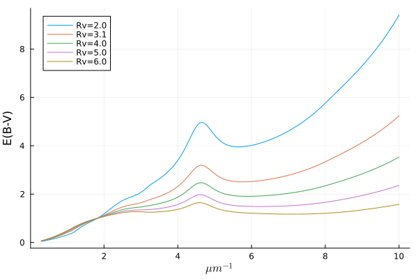
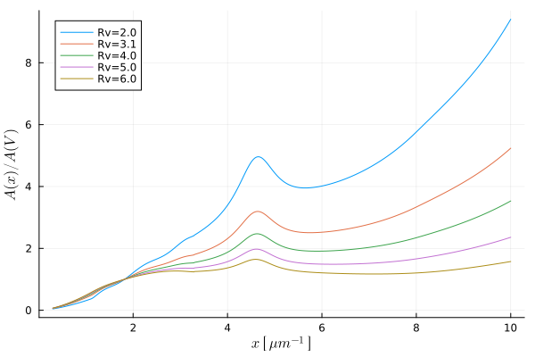
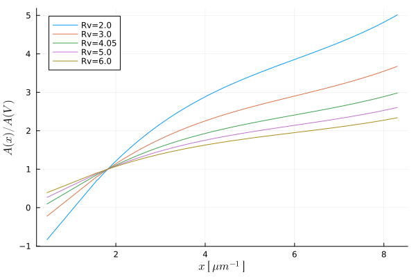
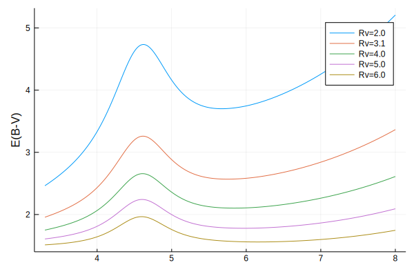
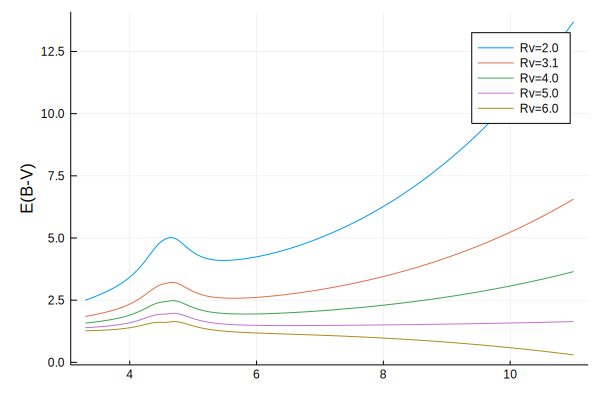
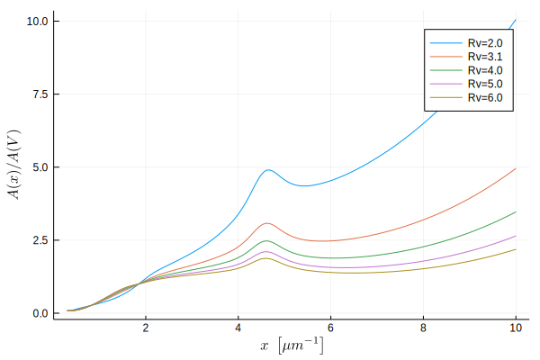
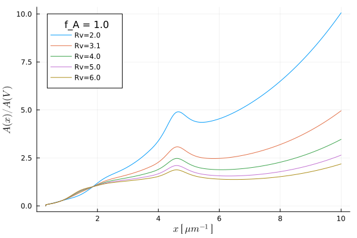
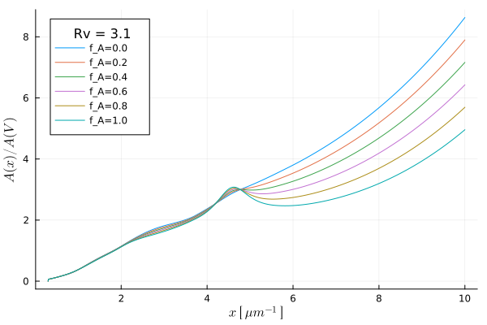

# [Color laws](@id laws)

The following empirical laws allow us to model the reddening of light as it travels to us. The law you use should depend on the type of data you have and the goal of its use. [`CCM89`](@ref) is very common for use in removing extinction from stellar observations, but [`CAL00`](@ref), for instance, is suited for galaxies with massive stars. Look through the citations and documentation for each law to get a better idea of what sort of physics it targets.

```@meta
DocTestSetup = quote
    using DustExtinction, Random
    Random.seed!(1)
end
```

## Usage

Color laws are constructed and then used as a function for passing wavelengths. Wavelengths are assumed to be in units of angstroms.

```jldoctest
julia> CCM89(Rv=3.1)(4000)
1.464555702942584

```

These laws can be applied across higher dimension arrays using the `.` operator

```jldoctest
julia> CCM89(Rv=3.1).([4000, 5000])
2-element Array{Float64,1}:
 1.464555702942584
 1.1222468788993019

```

these laws return magnitudes, which we can apply directly to flux by mulitplication with a base-2.5 logarithmic system (because astronomers are fun):

```math
f = f \cdot 10 ^ {-0.4A_v\cdot mag}
```

To make this easier, we provide a convenience [`redden`](@ref) and [`deredden`](@ref) functions for applying these color laws to flux measurements.

```jldoctest
julia> wave = range(4000, 5000, length=4)
4000.0:333.3333333333333:5000.0

julia> flux = 1e-8 .* wave .+ 1e-2
0.01004:3.3333333333333333e-6:0.01005

julia> redden.(CCM89, wave, flux; Av=0.3)
4-element Array{Float64,1}:
 0.006698646015454752
 0.006918253926353551
 0.007154659823737299
 0.007370491272731541

julia> deredden.(CCM89(Rv=3.1), wave, ans; Av=0.3) ≈ flux
true

```

## Advanced Usage

The color laws also have built-in support for uncertainties using [Measurements.jl](https://github.com/juliaphysics/measurements.jl).

```jldoctest
julia> using Measurements

julia> CCM89(Rv=3.1).([4000. ± 10.5, 5000. ± 10.2])
2-element Array{Measurement{Float64},1}:
 1.4646 ± 0.0033
 1.1222 ± 0.003

```

and also support units via [Unitful.jl](https://github.com/painterqubits/unitful.jl) and its subsidiaries. Notice how the output type is now `Unitful.Gain`.

```jldoctest
julia> using Unitful, UnitfulAstro

julia> mags = CCM89(Rv=3.1).([4000u"angstrom", 0.5u"μm"])
2-element Array{Gain{Unitful.LogInfo{:Magnitude,10,-2.5},:?,Float64},1}:
 1.4645557029425837 mag
 1.1222468788993019 mag

```

You can even combine the two above to get some really nice workflows exploiting all Julia has to offer! This example shows how you could redden some OIR observational data with uncertainties in the flux density.

```jldoctest
julia> using Measurements, Unitful, UnitfulAstro

julia> wave = range(0.3, 1.0, length=5)u"μm"
(0.3:0.175:1.0) μm

julia> err = randn(length(wave))
5-element Array{Float64,1}:
  0.2972879845354616
  0.3823959677906078
 -0.5976344767282311
 -0.01044524463737564
 -0.839026854388764

julia> flux = @.(300 / ustrip(wave)^4 ± err)*u"Jy"
5-element Array{Quantity{Measurement{Float64},𝐌*𝐓⁻²,Unitful.FreeUnits{(Jy,),𝐌*𝐓⁻²,nothing}},1}:
  37037.04 ± 0.3 Jy
  5893.14 ± 0.38 Jy
  1680.61 ± -0.6 Jy
 647.598 ± -0.01 Jy
   300.0 ± -0.84 Jy

julia> redden.(CCM89, wave, flux; Av=0.3)
5-element Array{Quantity{Measurement{Float64},𝐌*𝐓⁻²,Unitful.FreeUnits{(Jy,),𝐌*𝐓⁻²,nothing}},1}:
    22410.8 ± 0.18 Jy
    4229.74 ± 0.27 Jy
    1337.12 ± 0.48 Jy
 554.3349 ± 0.0089 Jy
     268.31 ± 0.75 Jy

```

## Parametric Extinction Laws

These laws are all parametrized by the selective extinction `Rv`. Mathematically, this is the ratio of the total extinction by the reddening

```math
R_V = \frac{A_V}{E(B-V)}
```

and is loosely associated with the size of the dust grains in the interstellar medium.

**Index:**
- [`CCM89`](@ref)
- [`OD94`](@ref)
- [`CAL00`](@ref)
- [`VCG04`](@ref)
- [`GCC09`](@ref)
- [`F99`](@ref)

### Clayton, Cardelli and Mathis (1989)



```@docs
CCM89
```

### O'Donnell 1994



```@docs
OD94
```

### Calzetti et al. (2000)



```@docs
CAL00
```

### Valencic, Clayton, & Gordon (2004)



```@docs
VCG04
```

### Gordon, Cartledge, & Clayton (2009)



```@docs
GCC09
```

### Fitzpatrick (1999)



```@docs
F99
```

## API/Reference

```@docs
redden
deredden
DustExtinction.ExtinctionLaw
DustExtinction.bounds
```

### Fittable Extinction Laws

#### Fitzpatrick & Massa (1990)


```@docs
FM90
```

### Mixture Extinction Laws

#### Gordon et al. (2016)




```@docs
G16
```
