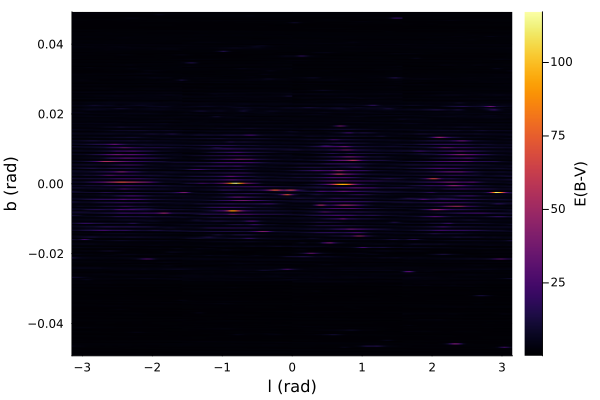

# [Dust Maps](@id maps)

## Usage

```@meta
DocTestSetup = quote
    using DustExtinction, Random
    Random.seed!(1)
end
```

```jldoctest
julia> dustmap = SFD98Map();

julia> dustmap(0, 2)
0.020303287464050277

julia> l = range(-π, π, length=5)
-3.141592653589793:1.5707963267948966:3.141592653589793

julia> b = range(-π/2, π/2, length=5)
-1.5707963267948966:0.7853981633974483:1.5707963267948966

julia> [dustmap(l[i], b[j]) for i in 1:length(l), j in 1:length(b)]
5×5 Array{Float64,2}:
 0.0159853  0.105782    1.40486  0.0158918  0.0119615
 0.0159853  0.0268289   3.47788  0.0654852  0.0119615
 0.0159853  0.0343457  99.6976   0.103875   0.0119615
 0.0159853  0.0432165   2.60569  0.0178195  0.0119615
 0.0159853  0.105782    1.40486  0.0158918  0.0119615

```

## Advanced Usage

Our dust maps also have native support for `Unitful.jl` and `Measurements.jl`.

```jldoctest
julia> using Measurements, Unitful

julia> l = 45u"°"; b=0u"°";

julia> dustmap = SFD98Map();

julia> dustmap(l, b)
6.4290331211742355 mag

julia> l = l ± 0.1u"°"; b = b ± 0.3u"°";

julia> dustmap(l, b)
6.4 ± 5.7 mag

```

## API/Reference

### Schlegel, Finkbeiner and Davis (1998)



```@docs
SFD98Map
```
