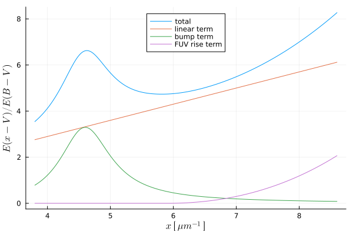

# [Fitting Models](@id models)

## Usage

```@meta
DocTestSetup = quote
    using DustExtinction, Random
    Random.seed!(1)
end
```

```jldoctest
julia> model = FM90(c1 = 0.2, c2 = 0.7, c3 = 3.23, c4 = 0.41, x0 = 4.6, gamma = 0.99);

julia> model(1500)
5.2521258452800135

julia> FM90()(1500)
5.152125845280013

```

These models can be applied across higher dimension arrays using the `.` operator

```jldoctest
julia> model = FM90(c1 = 0.2, c2 = 0.7, c3 = 3.23, c4 = 0.41, x0 = 4.6, gamma = 0.99);

julia> wave = [1000, 1200, 1800];

julia> model.(wave)
3-element Array{Float64,1}:
 12.562237969522851
  7.769215017329513
  4.890128210972148

```

## Advanced Usage

The fitting models also have built-in support for uncertainties using [Measurements.jl](https://github.com/juliaphysics/measurements.jl).

```jldoctest
julia> using Measurements

julia> FM90().([3000. ± 10.5, 2000. ± 10.2])
2-element Array{Measurement{Float64},1}:
 2.754 ± 0.015
 5.657 ± 0.077

```

and also support units via [Unitful.jl](https://github.com/painterqubits/unitful.jl) and its subsidiaries. Notice how the output type is now `Unitful.Gain`.

```jldoctest
julia> using Unitful, UnitfulAstro

julia> mags = FM90().([3000u"angstrom", 0.2u"μm"])
2-element Array{Gain{Unitful.LogInfo{:Magnitude,10,-2.5},:?,Float64},1}:
 2.754141727225919 mag
 5.657424435832562 mag

```

You can even combine the two above to get some really nice workflows exploiting all Julia has to offer!

```jldoctest
julia> using Measurements, Unitful, UnitfulAstro

julia> wave = range(0.15, 0.2, length=5)u"μm"
(0.15:0.0125:0.2) μm

julia> err = randn(length(wave))
5-element Array{Float64,1}:
  0.2972879845354616
  0.3823959677906078
 -0.5976344767282311
 -0.01044524463737564
 -0.839026854388764


julia> wave_new = @.(ustrip(wave) ± err/100)*u"μm"
5-element Array{Quantity{Measurement{Float64},𝐋,Unitful.FreeUnits{(μm,),𝐋,nothing}},1}:
     0.15 ± 0.003 μm
  0.1625 ± 0.0038 μm
   0.175 ± -0.006 μm
 0.1875 ± -0.0001 μm
    0.2 ± -0.0084 μm

julia> FM90().(wave_new)
5-element Array{Gain{Unitful.LogInfo{:Magnitude,10,-2.5},:?,Measurement{Float64}},1}:
     5.15 ± 0.12 mag
   4.809 ± 0.062 mag
   4.743 ± 0.029 mag
 4.9684 ± 0.0036 mag
     5.66 ± 0.63 mag

```

## API/Reference

#### Fitzpatrick & Massa (1990)



```@docs
FM90
```
